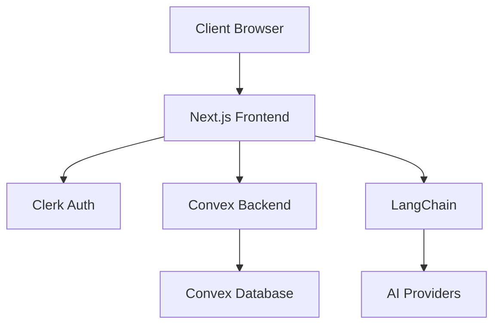

# Satoshi Agent Architecture

This document provides an overview of the Satoshi Agent's architecture and system design.

## System Overview

Satoshi Agent is built on a modern stack with the following key components:



## Component Structure

### Frontend Layer

1. **Next.js Application**
   - `/app` - App router and pages
   - `/components` - Reusable UI components
   - `/hooks` - Custom React hooks
   - `/lib` - Utility functions

2. **Key Components**
   - `ChatInterface` - Main chat UI
   - `ConvexClientProvider` - Database connection
   - `Dashboard` - User dashboard
   - `WorkflowManager` - Cold calling workflow

### Backend Services

1. **Convex Backend**
   - Real-time data synchronization
   - Database schema and mutations
   - API endpoints
   - Data validation

2. **Authentication (Clerk)**
   - User authentication
   - Session management
   - Authorization

3. **AI Integration (LangChain)**
   - Multiple LLM support
   - Conversation management
   - Context handling
   - Response streaming

## Data Flow

1. **Authentication Flow**
   ```mermaid
   sequenceDiagram
       User->>Frontend: Login Request
       Frontend->>Clerk: Auth Request
       Clerk-->>Frontend: Auth Token
       Frontend->>Convex: Store User Session
   ```

2. **Chat Flow**
   ```mermaid
   sequenceDiagram
       User->>Frontend: Send Message
       Frontend->>Convex: Store Message
       Frontend->>LangChain: Process Message
       LangChain->>AI Provider: Get Response
       AI Provider-->>Frontend: Stream Response
       Frontend->>Convex: Store Response
   ```

## Directory Structure

```
frontend/
├── app/
│   ├── dashboard/
│   │   ├── chat/
│   │   └── page.tsx
│   ├── layout.tsx
│   └── page.tsx
├── components/
│   ├── ChatInterface/
│   ├── Dashboard/
│   └── common/
├── convex/
│   ├── schema.ts
│   └── api/
├── lib/
│   ├── utils/
│   └── config/
└── public/
```

## Key Technologies

1. **Frontend**
   - Next.js 14+
   - React
   - TypeScript
   - Tailwind CSS
   - Radix UI

2. **Backend**
   - Convex
   - LangChain
   - Clerk

3. **AI Integration**
   - Anthropic
   - OpenAI

## Security Considerations

1. **Authentication**
   - JWT-based auth
   - Secure session management
   - Role-based access control

2. **Data Security**
   - Encrypted communication
   - Secure API endpoints
   - Environment variable protection

3. **API Security**
   - Rate limiting
   - Request validation
   - Error handling

## Performance Optimization

1. **Frontend**
   - Component code splitting
   - Image optimization
   - Caching strategies

2. **Backend**
   - Query optimization
   - Connection pooling
   - Response streaming

## Monitoring and Logging

1. **Application Monitoring**
   - Error tracking
   - Performance metrics
   - User analytics

2. **System Health**
   - API endpoint monitoring
   - Database performance
   - Resource utilization

## Future Considerations

1. **Scalability**
   - Horizontal scaling
   - Load balancing
   - Caching strategies

2. **Features**
   - Additional AI providers
   - Enhanced analytics
   - Custom workflows
